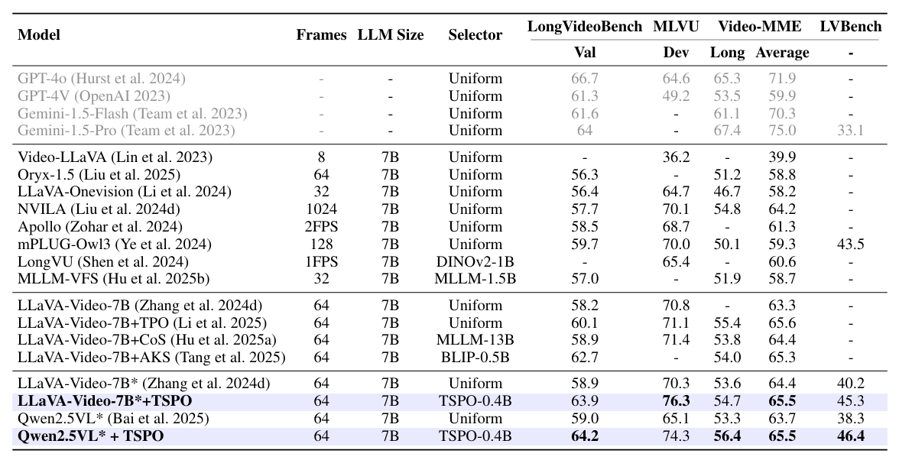

# TSPO: Temporal Sampling Policy Optimization for Long-form Video Language Understanding

[[📖 Paper](https://arxiv.org/pdf/2508.04369)] [[🤗 TSPO-model](https://huggingface.co/hzf666/TSPO-0.4B)] [[🤗 TSPO-train-data](https://huggingface.co/datasets/Canhui99/TSPO-10K)] 


## 👀 Overview

To addressing the challenges of unsupervised and non-differentiable sparse frame sampling in Video-MLLMs, We propose **Temporal Sampling Policy Optimization (TSPO)**, a reinforcement learning framework that advances long-form video understanding.

<div align="center">
  
</div>


## 🏆 Performance

- Our method achieves **63.9%** accuracy on LongVideoBench and **76.3%** on MLVU, setting a new state-of-the-art performance among 7B video-MLLMs.

- Our trained temporal agent (TSPO-0.4B) demonstrates strong generalizability. When applied to LLaVA-Video-7B, it achieves an average improvement of **4.3%** across four benchmarks; with Qwen2.5VL-7B, the gain reaches **6.1%**. Transferability to other backbones is further analyzed in Table 2 of our paper.

<div align="center">
  
</div>


## 🧸 Toy example

We present a toy example to show how TSPO works. We follow an intuition that Video-MLLMs can only give correct answers if the temporal agent samples the correct keyframes. Thanks to our joint modeling of keyframe sampling and language generation, we can use the language response accuracy reward $R_A$ derived from multiple-choice QA to supervise the temporal agent (without frame-level annotation).

- As shown in the GIF, through TSPO training, the temporal agent learns to select frames that lead to the correct answer for the question *"What is the scene at the beginning of the video?"*. As a result, $R_A$ increases, the predicted score peaks converge at the video's beginning, and the sampled frames converge to this time segment. 

- **For reproduce this example**, first set up the environment as the following section, and then download [LLaVA-Video-Qwen](https://huggingface.co/lmms-lab/LLaVA-Video-7B-Qwen2), [CLIP-Large](https://huggingface.co/openai/clip-vit-large-patch14), and [208.mp4](https://drive.google.com/file/d/1FDIxxIcyjL0v2O6sGc0KljXi8MRLDFJk/view?usp=sharing), and modify the ``model_name_or_path`` and ``clip_path`` in the ``toy_example.sh``.  The script can be run on a single GPU with at least 28GB.

<div align="center">
  
</div>


## 📐 Set up

```
conda create -n TSPO python=3.10
conda activate TSPO

pip install -r requirement.txt
pip install flash-attn==2.5.9.post1 --no-build-isolation
pip install qwen-vl-utils
pip install math_verify

cd lmms-eval
pip install -e .
cd ../
```


## 🎥 Demo 

- Download  [LLaVA-Video-Qwen-7B](https://huggingface.co/lmms-lab/LLaVA-Video-7B-Qwen2) or  [Qwen2.5vl-7B](https://huggingface.co/Qwen/Qwen2.5-VL-7B-Instruct), and our 🤗[TSPO-0.4B](). Then, you can try the ``demo/llava_video_tspo.py`` or ``demo/qwen25vl_tspo.py`` . 

- We provide example long videos: [208.mp4](https://drive.google.com/file/d/1FDIxxIcyjL0v2O6sGc0KljXi8MRLDFJk/view?usp=sharing), [7XWqI121-Q4.mp4](https://drive.google.com/file/d/1qh-8I1DsgH5TbqEbr05PPO5hdGtvUK23/view?usp=sharing), [5dJUUQufzw4.mp4](https://drive.google.com/file/d/1lBf6Oo7jkhi7-fSvrc_U7SqvqET3vhrh/view?usp=sharing). you can feel free to edit the "video_path" and "question".  Our model will output the responses and the sampled frames will be saved under the demo directory.

```
# using llava_video as backbone
CUDA_VISIBLE_DEVICES=0 python demo/llava_video_tspo.py

# using Qwen2.5vl as backbone
CUDA_VISIBLE_DEVICES=0 python demo/qwen25vl_tspo.py
```

<div align="center">
  
</div>


## 💾 Dataset

- Training
  - Download [LLaVA-Video-178K](https://huggingface.co/datasets/lmms-lab/LLaVA-Video-178K). You don't need to download the llava_hound video inside it.
  - Download our TSPO-10K train dataset, which is available at  [🤗 TSPO-train-data](https://huggingface.co/datasets/Canhui99/TSPO-10K)

- Evaluation

  - Download [LongVideoBench](https://huggingface.co/datasets/longvideobench/LongVideoBench), [MLVU](https://huggingface.co/datasets/sy1998/MLVU_dev), [VideoMME](https://huggingface.co/datasets/lmms-lab/Video-MME), [LVBench](https://huggingface.co/datasets/DongfuJiang/LVBench)

  - For LongVideoBench and LVBench, we use the original JSON files. For MLVU and VideoMME, we convert their Parquet files into JSON format. These JSON files are stored in `script/jsons`.

  - To adapt the data to our commonly used evaluation pipeline, we further organize them into TSV format and place them under `evaluation/data`.

  - The final directory structure is as follows:

    ```
    - evaluation
    	- data
    		- *.tsv
    		- videos
    			- LongVideoBench
    				- video
    					- data
    						- *.mp4
                - MLVU
    ```

    

## 🚀 Training

First download [LLaVA-Video-Qwen](https://huggingface.co/lmms-lab/LLaVA-Video-7B-Qwen2) and [CLIP-Large](https://huggingface.co/openai/clip-vit-large-patch14) and modify the ``model_name_or_path`` and ``clip_path `` in the ``train_deepspeed.sh``.  For data path, you should modify the ``video_folder`` to be the path of  LLaVA-Video-178K  and ``jsonl_path`` to be the path of TSPO-10K.jsonl

Then, you can run the following command:

```
bash train_deepspeed.sh
```

To get your trained TSPO-0.4B weights, you should run the merge_weights.py

```
python scripts/merge_weights.py
```


## 🔮 Evaluation

- Extract clip feature and select frame index
  - You need to edit the `model_path`, `root`, and `save_root` in `mp_tools/vlmeval/config.py`.
  - The first run will save the features locally; subsequent runs will directly load the saved features, making the process much faster.
  
  ```
  cd mp_tools
  bash get_frame_idx.sh LongVideoBench TSPO  # dataset_name method_name 
  cd ../
  ```
  
- Run Lmms-eval
  - For LongVideoBench, VideoMME, and MLVU, we use lmms-eval, which we have adapted to the current project by adding files such as `llava_vid_tspo.py` and `qwen_2_5_vl_tspo.py`.
  - Run: 

  ```
  # For LLaVA-Video
  bash evaluation/TSPO_llava_video.sh LongVideoBench TSPO  # dataset_name method_name 
  
  # For Qwen2.5-VL+TSPO
  bash evaluation/TSPO_qwen25_vl.sh LongVideoBench TSPO
  ```

  

- You can evaluate original model without our TSPO by:

  ```
  # For Original Qwen2.5-VL 
  bash evaluation/original_qwen25_vl.sh LongVideoBench xxx  # dataset_name method_name 
  
  # For Original LLaVA-Video
  bash evaluation/original_llava_video.sh LongVideoBench xxx # dataset_name method_name 
  ```

  

- For [LVBench](https://github.com/zai-org/LVBench), we use its own evaluation protocol. The detailed code is to be released soon.


## Acknowledgements

[Open-LLaVA-Video-R1](https://github.com/Hui-design/Open-LLaVA-Video-R1),  [Lmms-eval](https://github.com/EvolvingLMMs-Lab/lmms-eval),  [VLMEvalKit](https://github.com/open-compass/VLMEvalKit),  [AKS](https://github.com/ncTimTang/AKS)


## Citations

If you find our work helpful for your research, please consider citing our work.   

```
@article{tang2025tspo,
  title={TSPO: Temporal Sampling Policy Optimization for Long-form Video Language Understanding},
  author={Tang, Canhui and Han, Zifan and Sun, Hongbo and Zhou, Sanping and Zhang, Xuchong and Wei, Xin and Yuan, Ye and Xu, Jinglin and Sun, Hao},
  journal={arXiv preprint arXiv:2508.04369},
  year={2025}
}
```

